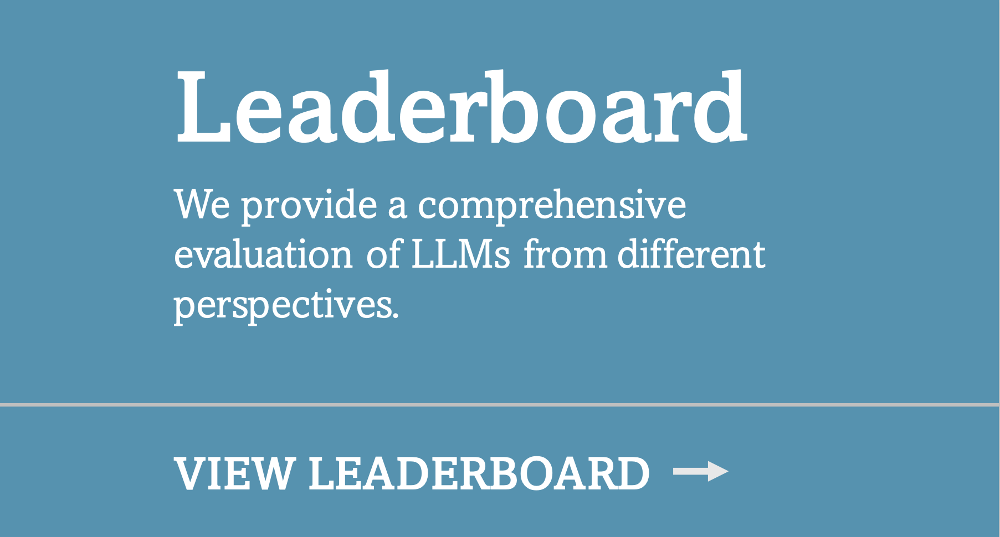
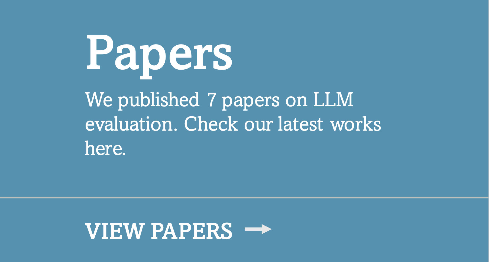
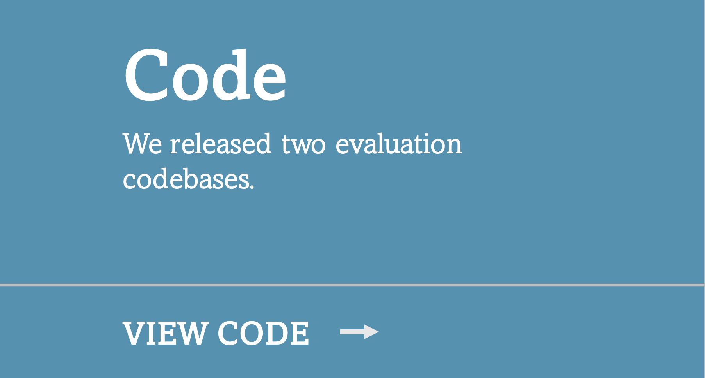
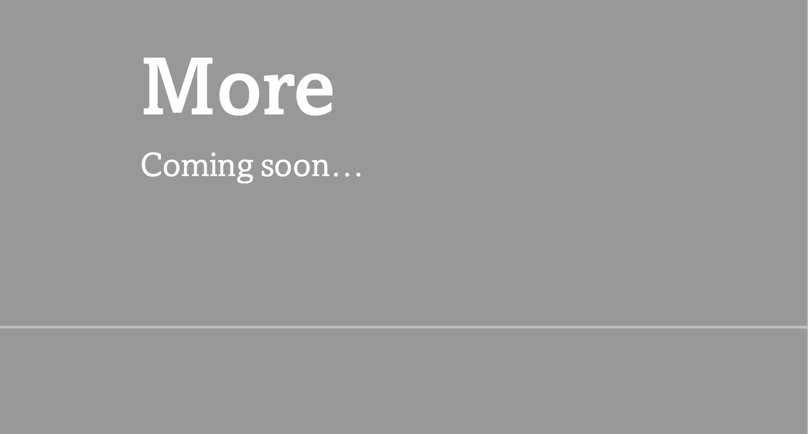

   
  <strong>
    Original research on evaluation of LLMs conducted by Microsoft Research and other collaborated institutes. *(Updated at: 2023/10)*
  </strong> 
  (Contact: <a href="https://jd92.wang/">Jindong Wang</a>, also see our projects on <a href="https://llm-enhance.github.io/">LLM enhancement</a>)

 

<!-- 
<table style="border-collapse: collapse;">
  <tr>
    <td align="center">
      <a href="https://llm-eval.github.io/advprompt/">
        <src="../assets/img/dyval.jpg" alt="Image 1">
      </a >
    </td>
    <td align="center">
      <a href="https://llm-eval.github.io/papers/">
        <src="../assets/img/dyval.jpg" alt="Image 2">
      </a >
    </td>
    <td align="center">
      <a href="https://llm-eval.github.io/code/">
        <src="../assets/img/dyval.jpg" alt="Image 3">
      </a >
    </td>
    <td align="center">
      <a href="https://llm-eval.github.io">
        <src="../assets/img/dyval.jpg" alt="Image 4">
      </a >
    </td>
  </tr>
</table> -->

---

  
<!-- &nbsp; &nbsp; &nbsp; &nbsp; -->
  
<!-- &nbsp; &nbsp; &nbsp; &nbsp;  -->
  
<!-- &nbsp; &nbsp; &nbsp; &nbsp; -->
  

<!-- 

 -->