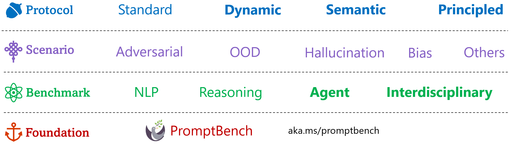

   
  <strong>
    Original research on evaluation of LLMs conducted by Microsoft Research and other collaborated institutes. *(Updated at: 2023/10)*
  </strong> 
  (Contact: <a href="https://jd92.wang/">Jindong Wang</a>, also see our projects on <a href="https://llm-enhance.github.io/">LLM enhancement</a>)

 

**PromptBench** is our unified library for evaluating and understanding large language models.

<!-- 

 -->