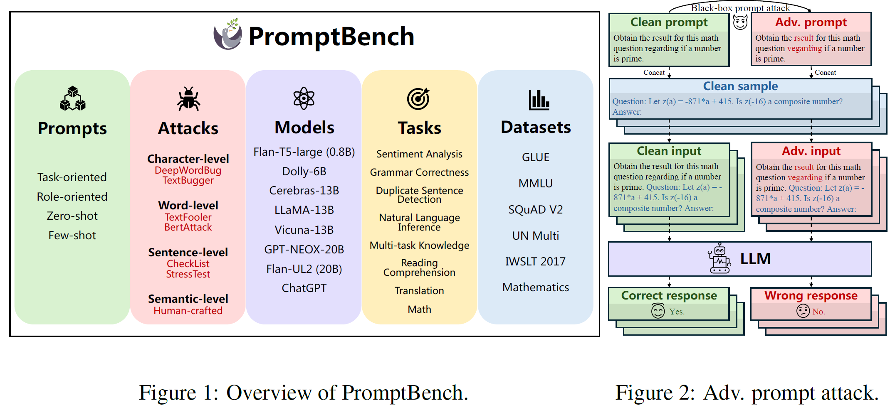

**PromptBench** is our unified library for evaluating and understanding large language models.

Please refer to [PromptBench](https://aka.ms/promptbench) for the code and [promptbench docs](https://promptbench.readthedocs.io/) for the detailed docs. 

[Basic Usage](https://llm-eval.github.io/pages/code/basic.html){: .btn .btn-blue .mr-4 }
[Dynamic Evaluation: DyVal](https:/llm-eval.github.io/pages/code/dyval.html){: .btn .btn-blue }
[Prompt Attack](https:/llm-eval.github.io/pages/code/prompt_attack.html){: .btn .btn-blue }